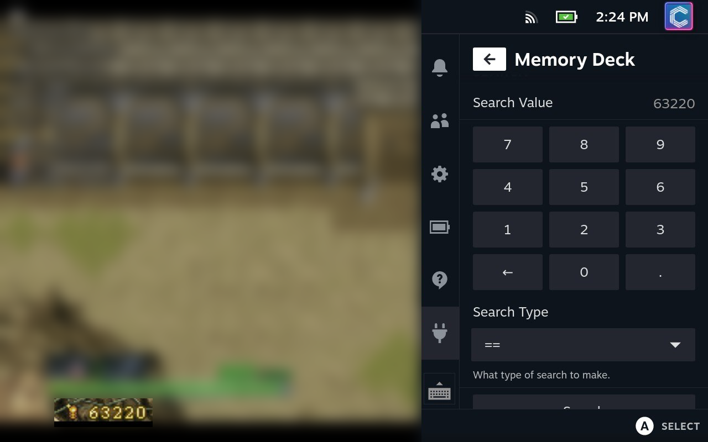

# MemoryEditor

A scanmem wrapper in a [decky-loader](https://github.com/SteamDeckHomebrew/decky-loader) plugin.

A revived and modernised fork of [Memory Deck](https://github.com/CameronRedmore/memory-deck) by Camzie99.

This plugin allows you to scan for, and edit values in memory. Akin to something like [Cheat Engine](https://cheatengine.org).



## Warning
This plugin directly manipulates memory. This can cause crashes, and other issues. Use at your own risk.

## Code Warning
This plugin started life as a rough proof-of-concept. It has since been
modernised: it targets the current Decky toolchain (`@decky/ui` + `@decky/api`),
scans run off the backend event loop with live progress and a cancel button,
and value freezing is supported.

PRs to clean up, refactor, and extend are still very welcome!

## How to Use

### Selecting a Process

When first opening MemoryEditor, you will need to select a process. The plugin will automatically load a list of processes for you when opened.

If you need to reload the process list for any reason, simply press the `Reload Process List` button.

You will need to do this after closing / opening processes after MemoryEditor has been opened.

#### Changing Process

After a process has been selected, you can change it by pressing the `Choose Another Process` button.

### Finding a Value

To find a value in memory, a number of searches need to be performed in sequence.
Each search should ideally change something to narrow the search down further and further, until eventually hopefully reaching just a single value (or at least a small enough list to manually check).

#### Search Operators

When searching for a value, you can use the following operators:

| Operator     | Description                                                                       |
| ------------ | --------------------------------------------------------------------------------- |
| ==           | The value in memory *exactly matches* the search value.                         |
| !=           | The value in memory *does not match* the search value.                          |
| &gt;         | The value in memory is *greater* than the search value.                             |
| &lt;         | The value in memory is *less* than the search value.                                |
| Not Changed  | The value in memory has *not* changed since the last search.               |
| Changed      | The value in memory *has* changed since the last search.                        |
| Increased    | The value in memory has *increased* since the last search.                      |
| Decreased    | The value in memory has *decreased* since the last search.                      |
| Increased By | The value in memory has *increased* by the search value since the last search.  |
| Decreased By | The value in memory has *decreased* by the search value since the last search.  |
| Any          | Search for *all* values in memory. Only really useful for an "Unknown Initial Value"                                              |

Your first search should probably be a `==` search, as this will find all values that match the search value. But you may potentially want to use the `Any` search if you don't know what the initial value is.

The `!=` operator could also technically be used here. But it's far more likely that you'll want to use `Any`.

All other searches make use of the previous search results, so you will need to perform a search before you can use them.

#### Running the Search

Once you have entered your search value and operator. Press the `Search` button to run the search.

This will ask the backend to run the scan you've selected.

Once the process is complete, you will be able to see the number of matches found at the bottom of the QAM.

Once values have been found, do something in-game that will change the value you're searching for. Then run another search. If you know the new value, you can use the `==` operator again. If you don't know the new value, you can use the other operators depending on the information you *do* know about the value.

Keep repeating searches until there are less than *10* matches left.

### Editing Values
Once there are less than 10 matches, a new section will appear at the bottom of the QAM.

This section will list every match address (with its detected type), each with
a `Change` and a `Freeze` button.

You can enter a new value with the `Change Value` field, and press the `Change`
button to write it to that address. The `±` key on the numpad lets you enter
negative values.

### Freezing Values
Press the `Freeze` button on a match to continuously hold it at its current
value — useful for locking health, ammo, timers, and similar. A 🔒 appears next
to frozen addresses. Press `Unfreeze` to release it. Frozen values are cleared
automatically when you switch processes.

### Auto-Detecting the Running Game
When no process is attached, MemoryEditor tries to detect the currently running
Steam game and offers a `🎮 Attach to … (detected game)` shortcut at the top of
the process list, so you usually don't have to hunt through the full list.

### Resetting a Scan
If you want to reset the scan, you can press the `Reset Scan` button at the top of the page.
This will reset the scan and empty out all known values. This allows you to then start another initial scan.

## Memory Workbench
For a Cheat-Engine-style experience, press `Open Memory Workbench` in the QAM
(shown once a process is attached) to open a full-screen page with:

- **Address list** — add addresses by absolute value (`0x…`) or by
  `module + offset`, give each a label and a type, and watch its live value.
  Set a new value, freeze/unfreeze, or view it in the hex viewer per row.
- **Memory viewer** — a hex + ASCII dump of any address.
- **Cheat tables** — Save/Reload/Delete a table of addresses per game
  (keyed by its Steam App ID), so your list is there next time.
- **Static tagging** — addresses that live inside a loaded module are labelled
  with the module name.

You can also press `Add to Workbench` on any search result to drop it into the
saved table.

> Note: found addresses are not guaranteed to be the same after the game
> restarts (ASLR). Saved tables preserve your labels/types; re-find the address
> in a new session, or use `module + offset` for addresses inside a module.

## Installation
This is a personal project and is installed manually (not via any plugin store).

Install [Decky Loader](https://github.com/SteamDeckHomebrew/decky-loader) using
their instructions, then copy the release zip to the Deck and, in Desktop Mode,
remove any previous copy and unpack the new one:

```bash
sudo rm -rf ~/homebrew/plugins/memory-deck ~/homebrew/plugins/memoryeditor
sudo unzip memoryeditor-*.zip -d ~/homebrew/plugins/
sudo systemctl restart plugin_loader
```

## Future Plans
- [x] Show variable type in found value list
- [x] Value freezing
- [x] Async scans with progress + cancel
- [x] Auto-detect the running game
- [x] Negative value entry
- [x] Live value refresh in the results list
- [x] Frozen values panel
- [x] Undo a value change
- [x] Hex value entry on the numpad
- [x] Range operator support
- [x] Search for strings
- [x] Memory workbench: address list, hex viewer, save/load cheat tables per game
- [ ] Pointer scanning (static pointer chains that survive restarts)
- [ ] AOB / byte-pattern scanning

# License
This project is licensed under the GPL-3.0 License - see the [LICENSE](LICENSE) file for details.

This project uses `libscanmem` and includes source code for `scanmem` and `libscanmem`, licensed under the GPL-3.0 License and the LGPL-3.0 License respectively.

A copy of the licenses for these projects can be found under the `backend/scanmem` folder. And can be found in the `bin` folder of the plugin once compiled.

This project also uses a modified version of a `scanmem` Python bindings library. The source for this is located under `scanmem.py`. This library is also licensed under LGPL-3.0.